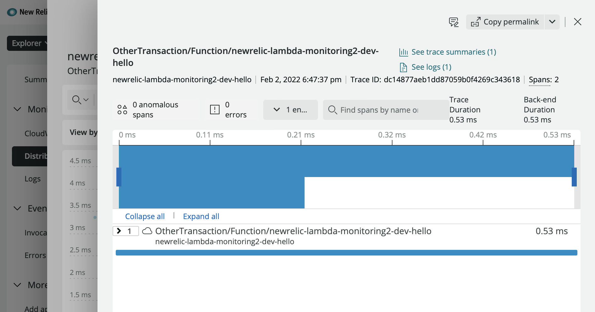

# Enable New Relic Lambda Monitoring using Serverless framework

This tutorial demonstrates how to create brand new AWS Lambda app using Serverless framework and enable New Relic integration

At the end of this tutorial, you will be able to:

-   create a deploy a simple HTTP Lambda function using Node.js and Serverless framework
-   enable (New Relic Lambda monitoring)[https://docs.newrelic.com/docs/serverless-function-monitoring/aws-lambda-monitoring/enable-lambda-monitoring/enable-aws-lambda-monitoring]
-   view APM, Distributed Tracing, Logs In Context for the Lambda function in New Relic One

## Step 1: create and deploy new Lambda using Serverless framework

```bash
# install AWS cli at https://docs.aws.amazon.com/cli/latest/userguide/cli-chap-getting-started.html and configure credentials
# create new IAM user in AWS https://console.aws.amazon.com/iamv2/home#/users
# give it required permission AdminstratorAccess OR use this https://shorturl.at/bizJV
# > you will need the name of this account in later step
aws configure

# install serverless framework
npm install -g serverless

# create new serverless NodeJS HTTP App (select AWS - Node.js - HTTP API template) and deploy it
# select No for register to Serverless dashboard and yes to deploy your project
sls

# login to https://console.aws.amazon.com/lambda/home
# you should see your function in the list
# click on the new function and click on API Gateway trigger
# open the API Endpoint on your browser and make sure you can see reponse
```

## Step 2: Link NewRelic and AWS

```bash
# sign up for a free New Relic Account https://newrelic.com/signup, no credit card required
# make sure you have Python 3 installed https://www.python.org/downloads/

# install newrelic-lambda cli
pip3 install newrelic-lambda-cli

# get your NewRelic user and account key https://docs.newrelic.com/docs/apis/intro-apis/new-relic-api-keys/, you will only need to do this once
newrelic-lambda integrations install --nr-account-id YOUR_NR_ACCOUNT_ID --nr-api-key YOUR_NEW_RELIC_USER_KEY --aws-region us-east-1
```

## Step 3: enable Labmda monitoring

-   modify the `serverless.yml` file as follow

```yml
service: newrelic-lambda-monitoring2
frameworkVersion: '2 || 3'

provider:
  name: aws
  runtime: nodejs12.x
  lambdaHashingVersion: '20201221'

functions:
  hello:
    handler: handler.hello
    events:
      - httpApi:
          path: /
          method: get

plugins:
  - serverless-newrelic-lambda-layers

custom:
  newRelic:
    accountId: YOUR_NR_ACCOUNT
    apiKey: YOUR_NR_ACCOUNT_APIKEY
    linkedAccount: ACCOUNT_YOU_CREATED_IN_STEP1_ABOVE
```

- deploy the app again (make sure you are inside the app directory)

```bash
# install NewRelic serverless layer
 npm install --save-dev serverless-newrelic-lambda-layers

 # deploy the app again
sls deploy
```

## Step 4: Run quick load test on your lambda

```bash
# install https://www.artillery.io
npm install -g artillery@latest

# run quick load test on your new lambda App for 30 seconds, 10 virtual users and rate of arrival of 3
# replace the URL with the one you get from step 1
artillery quick https://vh2j0gynz3.execute-api.us-east-1.amazonaws.com -n 10 -d 30 -r 3
```

## Step 5: Login to New Relic and view Distributed Tracing for your labmda
- login to https://one.newrelic.com and select your labmda function from Amazon Web Services > Lambda functions
- select Distributed Tracing, you should see something like this


- notice the "No logs found" is displayed


## Step 6: Enable Logs in Context for Lambda functions
- modify `handler.js` file as follow

```javascript
"use strict";

module.exports.hello = async (event) => {
  console.log('Received request', JSON.stringify(event));
  return {
    statusCode: 200,
    body: JSON.stringify(
      {
        message: "Go Serverless v2.0! Your function executed successfully!",
        input: event,
      },
      null,
      2
    ),
  };
};
```

- login to AWS Console https://console.aws.amazon.com/lambda/home and select your function
- select Configuration > Environment variables > Edit
- add `NEW_RELIC_EXTENSION_SEND_FUNCTION_LOGS` = `true`
- deploy the app again by running `sls deploy`

```bash
# deploy the app again
sls deploy

# run load test again
artillery quick https://vh2j0gynz3.execute-api.us-east-1.amazonaws.com -n 10 -d 30 -r 3
```

- go back to New Relic and select new traces
- you now should be able to see the Logs in Context




